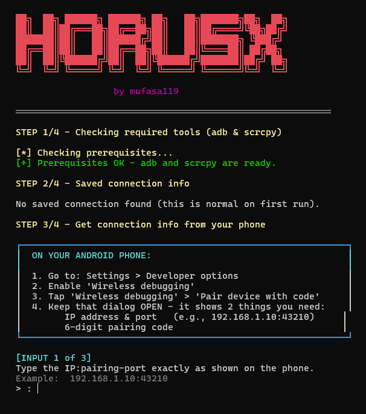
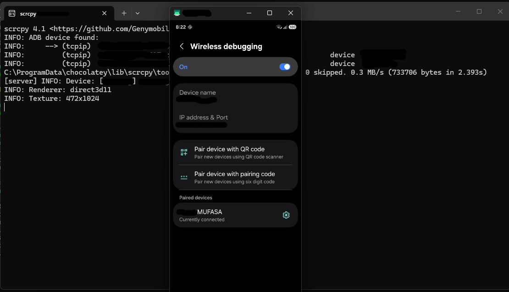

<p align="center">
  
</p>

<h1 align="center">HORUSx</h1>

<p align="center">
  <em>Control any Android phone from your Windows PC — over Wi-Fi, no cables, no root.</em>
</p>

<p align="center">
  
  
  
  
</p>

---

**Built by [mufasa119](https://github.com/mufasa119)**  
**Powered by [scrcpy](https://github.com/Genymobile/scrcpy) + [ADB](https://developer.android.com/tools/adb)**

---

## ✨ Features

- 🚀 **Auto-installs dependencies** — if ADB or scrcpy are missing, HORUSx installs them via Winget on the first run
- 📡 **Wireless** — connects over Wi-Fi using Android's built-in Wireless Debugging
- ⚡ **Low latency** — 30 FPS at ~50–100 ms, powered by scrcpy
- 🖱️ **Full remote control** — clicks become taps, your keyboard types on the phone
- 💾 **Remembers your setup** — optional local config saves your connection for one-key reconnects
- 🧹 **Auto-disconnects** — closing scrcpy cleanly drops the ADB connection
- 🎨 **Stylish CLI** — colored banner because tools should look good too
- 🔒 **No data collection** — nothing is ever sent anywhere. Everything runs on your PC
- 📦 **Single `.exe`** — no Python, no Node, no manual setup for the user

---

## 📥 Install — For First-Time Users

### Step 1 — Download HorusX.exe

Go to the [**Releases**](../../releases) page and download the latest **`HorusX.exe`**.

Save it anywhere — for example: `C:\HorusX\HorusX.exe`

> ⚠️ **Windows SmartScreen warning?**  
> You may see *"Windows protected your PC."*  
> Click **"More info" → "Run anyway"**.  
> This appears because the `.exe` isn't code-signed — it's safe.

---

### Step 2 — Run it for the first time

**Double-click `HorusX.exe`.**

The script will start and check if ADB and scrcpy are installed.

**If they're missing**, you'll see:

```
[!] Missing tools detected:
    - adb
    - scrcpy

Install them automatically now? [Y/n]:
```

→ **Press `Y` and Enter.** The script installs both tools automatically using Windows' built-in Winget.

Wait 1–2 minutes while it downloads and installs.

---

### Step 3 — Restart PowerShell (Windows requirement)

When the install finishes, the script tells you:

```
[!] IMPORTANT: Restart PowerShell for the new tools to be on PATH.
    After restart, run horusX.ps1 again.

Press Enter to exit
```

→ **Press Enter to close.** This is normal — Windows can't update PATH for programs that are already running.

---

### Step 4 — Run HorusX.exe again

**Double-click `HorusX.exe` again.**

This time the prerequisites check passes:

```
[*] Checking prerequisites...
[+] Prerequisites OK.
```

You're now ready to connect your phone. Continue to **Quick Start** below.

---

### Step 5 — Connect your phone (one-time setup)

On your Android phone:

1. **Settings → About phone** → tap **Build number** 7 times
2. **Settings → Developer options** → enable **Wireless debugging**
3. Tap **Wireless debugging** → **Pair device with pairing code**
4. Note the **IP:port** and **6-digit code** — **keep this screen open**

In HorusX.exe:

- Enter the **IP:pairing-port** → press Enter
- Enter the **6-digit code** → press Enter
- Enter the **connection port** (from the main Wireless Debugging screen — a *different* number) → press Enter

**scrcpy opens — your phone appears on your PC screen.** 🎉

---

### 🔁 From now on

Once you've paired successfully, the next time you run HorusX.exe:

- It shows your saved connection info
- Asks **"Use saved connection info? [Y/n]"**
- Press **Enter** → reconnects automatically → scrcpy launches

Just make sure **Wireless Debugging is still ON** on your phone.

---

## ❗ Do NOT run as Administrator

**Run HORUSx as a normal user.**

- HORUSx only needs admin rights if it's installing ADB or scrcpy for the first time
- Windows will prompt for that automatically via a UAC popup — click **Yes** on that popup only
- You don't need to launch the tool as administrator
- Running elevated can create files with the wrong ownership and is unnecessary

---

## 🖥️ Requirements

- **Windows 10 (1809+) or Windows 11**
- **Android 11+** on the phone (for Wireless Debugging)
- **Internet connection** (for the one-time auto-install of ADB + scrcpy)

No manual setup needed — HORUSx installs ADB and scrcpy automatically on the first run.

---

## 📸 Screenshots

### 🖥️ The Script

<p align="center">
  
</p>

### 📱 Live Session — Phone Mirrored to PC

<p align="center">
  
</p>

---

## 🎮 Controls (in scrcpy)

| Action | Shortcut |
|---|---|
| Tap | **Left-click** |
| Swipe | **Click and drag** |
| Scroll | **Mouse wheel** |
| Back | **Right-click** |
| Home | `Ctrl + H` |
| Type text | Just **start typing** |
| Phone screen off (keeps mirroring) | `Ctrl + Shift + O` |
| Full screen | `Ctrl + F` |

---

## 🛠️ Build from Source

If you want to modify the script or build your own version:

```powershell
# 1. Install ps2exe (compiles .ps1 to .exe)
Set-ExecutionPolicy -Scope Process -ExecutionPolicy Bypass
Install-Module ps2exe -Scope CurrentUser -Force

# 2. Compile
cd C:\path\to\HorusX
Import-Module ps2exe
Invoke-PS2EXE .\horusX.ps1 .\HorusX.exe -iconFile .\horusX.ico
```

---

## 🐛 Troubleshooting

| Issue | Fix |
|---|---|
| `adb not recognized` | Run `winget install Google.PlatformTools` and restart PowerShell |
| `scrcpy not recognized` | Run `winget install Genymobile.scrcpy` and restart PowerShell |
| Pairing fails | Reopen the pairing dialog — codes expire quickly |
| Connection times out | Phone and PC must be on the same Wi-Fi |
| "exit code -1978335189" from Winget | Not an error — means "already installed, nothing to upgrade" |
| Old icon shows after update | Run `ie4uinit.exe -show` to refresh Windows icon cache |
| EXE blocked by SmartScreen | Click **More info → Run anyway** |
| Winget not available | Update Windows — Winget ships with Windows 10 1809+ |

---

## ❓ First-Time Questions

**"Do I need to install anything manually?"**  
No — HorusX installs ADB and scrcpy for you on first run.

**"Why does it need to be restarted?"**  
Windows only updates its PATH for *new* terminal sessions. The script needs a fresh shell to see the newly installed tools.

**"Do I need to run it as administrator?"**  
No. Run it as a normal user. Windows will pop a UAC prompt during the tool install — click Yes on that prompt only.

**"Is this safe?"**  
Yes. HorusX runs entirely on your PC. Nothing is uploaded, no accounts, no telemetry.

---

## 🔒 Privacy & Security

HORUSx runs **entirely on your PC**. It does **not** send any data anywhere.

- ✅ No accounts, no telemetry, no cloud
- ✅ The optional saved config (`horus_config.json`) is a plain local file with only: IP, port, last-used time
- ✅ All traffic stays on your own Wi-Fi network

**Important:**
- Only use on **your own devices**, on **trusted networks**
- Turn off Wireless Debugging on the phone when not using HORUSx
- **Never install this on someone else's phone without their explicit knowledge and consent**

---

## 🗺️ Roadmap

- [ ] Dark/light banner themes
- [ ] Multi-device profile management
- [ ] Optional encrypted config storage
- [ ] macOS / Linux support

---

## 📄 License

**MIT License** — free to use, modify, and distribute. See [LICENSE](LICENSE).

---

## 🙌 Credits

- Built by **[mufasa119](https://github.com/mufasa119)**
- Powered by **[scrcpy](https://github.com/Genymobile/scrcpy)** by Genymobile
- Uses **[ADB](https://developer.android.com/tools/adb)** from Android Platform Tools

---

⭐ **If HorusX is useful to you, please star the repo!**  
🐛 **Found a bug? Open an issue.**  
💡 **Have an idea? Start a discussion.**
